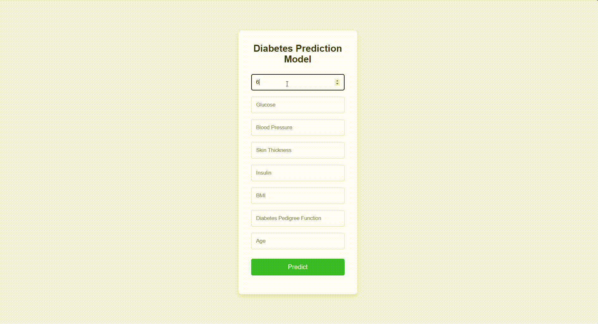

# Diabetes Prediction Web Application

## Overview
This Flask-based web application predicts the likelihood of diabetes using a Random Forest machine learning model. The project aligns with the United Nations Sustainable Development Goal 3 (Good Health and Well-being) by providing accessible health risk assessment tools.

## Features
- User-friendly web interface for input of health metrics
- Real-time prediction using Random Forest algorithm
- Visual representation of prediction results
- Responsive design for mobile and desktop use

## Technology Stack
- **Backend**: Python, Flask
- **Frontend**: HTML, CSS, JavaScript
- **Machine Learning**: scikit-learn (Random Forest Classifier)
- **Data Processing**: NumPy, Pandas

## Usage
1. Start the Flask application:
 ```shellscript
 python app.pypython app.py
 ```

2. Open your web browser and navigate to `http://localhost:5000`
3. Enter the required health metrics:
   - Number of Pregnancies
   - Glucose Level
   - Blood Pressure
   - Skin Thickness
   - Insulin Level
   - BMI
   - Diabetes Pedigree Function
   - Age

4. Click "Predict" to see the results

   

## Model Information

The application uses a Random Forest Classifier, trained on the Pima Indians Diabetes Database. The model takes into account various health metrics to predict diabetes risk with high accuracy.

## Contributing to UN SDG Goal 3

This project contributes to UN Sustainable Development Goal 3 (Good Health and Well-being) by:

- Providing accessible health risk assessment tools
- Raising awareness about diabetes risk factors
- Encouraging preventive healthcare practices
- Supporting early detection of potential health risks


## Disclaimer

This application is for educational purposes only and should not be used as a substitute for professional medical advice, diagnosis, or treatment.

## Acknowledgments
- Pima Indians Diabetes Database
- scikit-learn documentation
- Flask documentation

  
